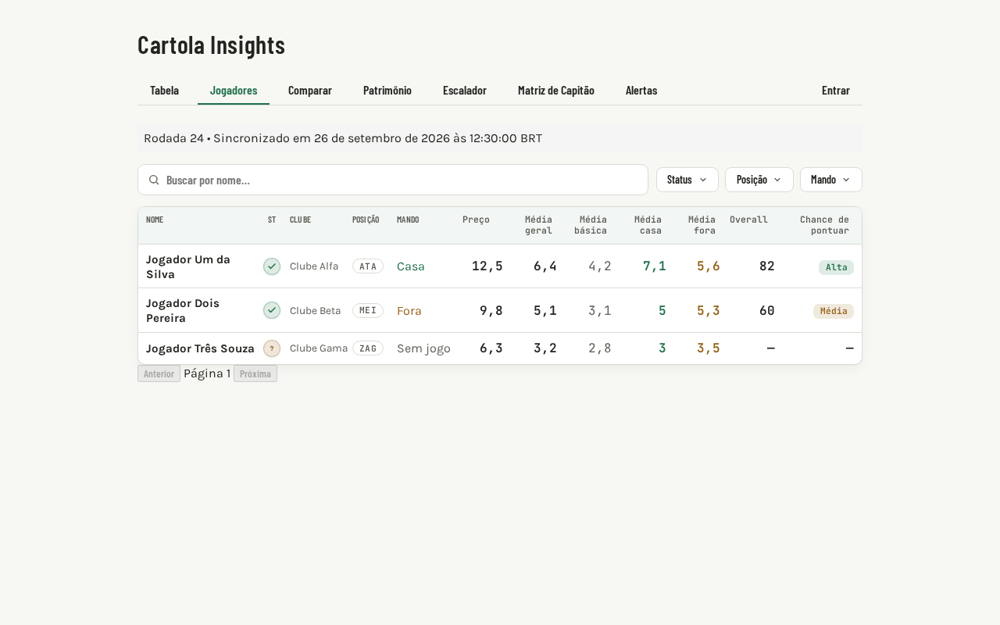
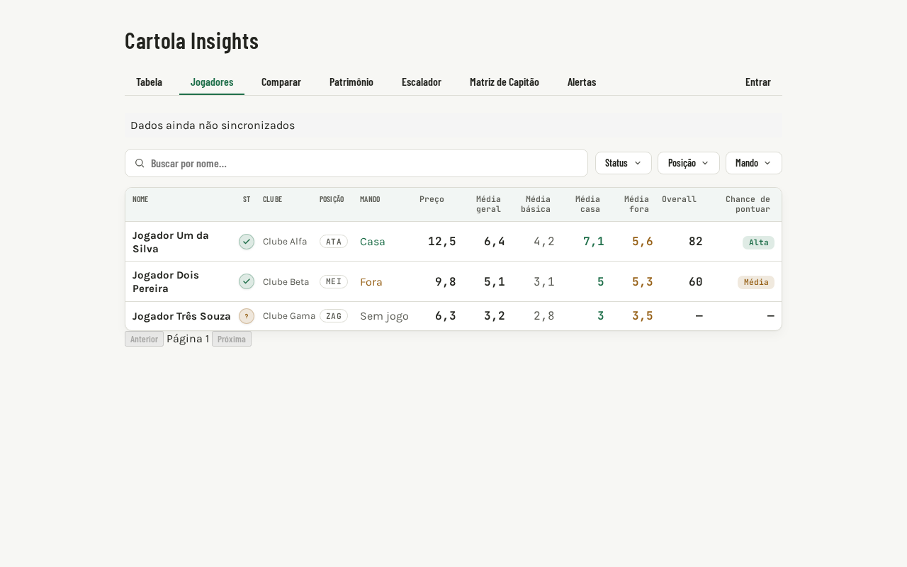
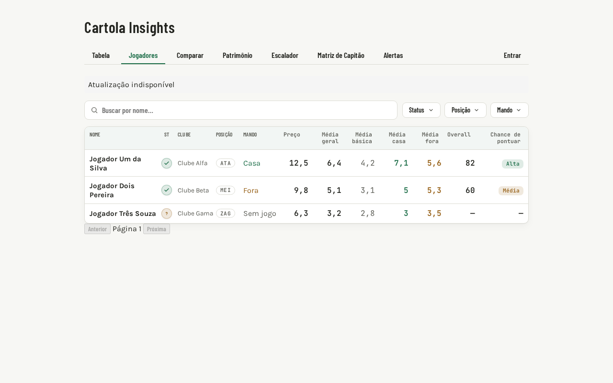

# Evidências do indicador de sincronização — #39

_Indicar rodada e horário da última sincronização nas análises._

## Resumo

O cliente consulta `GET /dados/status`; o componente reutilizável cobre carregamento, sucesso, vazio, erro e timestamp inválido. A falha do status não bloqueia os dados principais de Jogadores nem o formulário do Escalador.

## Estados cobertos

### Normal

```text
Rodada 24 • Sincronizado em 26 de setembro de 2026, 12:30:00 BRT
```

Exibe rodada, data/hora no fuso do navegador e o timestamp UTC original no `title`.

### Vazio

```text
Dados ainda não sincronizados
```

O backend respondeu `estado: "sem_dados"`, sem sincronização concluída.

### Erro

```text
Atualização indisponível
```

Uma resposta 5xx ou erro de rede fica isolada no indicador; a tabela de jogadores continua visível.

## Evidência visual







## Testes e cobertura

- 3 testes do cliente: sucesso, resposta sem dados e erro.
- 9 testes do componente: estados, carregamento, fuso, timestamp inválido, rodada opcional, `role="status"` e cleanup.
- Testes de página comprovam que falha do status não oculta os fluxos principais.
- `npm run coverage`: 56 arquivos e 672 testes aprovados; 99,9% statements, 97,35% branches, 100% functions e 100% lines.
- `npm run lint`: 0 erros; 2 avisos preexistentes em `src/contexts/AuthContext.tsx`.
- `npm run test:e2e`: 4 aprovados e 2 ignorados (capturas restritas ao viewport desktop).
- `npm run build`: aprovado.

## Contrato da API

```typescript
GET /dados/status
Response: {
  estado: 'sincronizado' | 'sem_dados',
  rodada: number | null,
  sincronizado_em: string | null
}
```

## Acessibilidade e comportamento

- O indicador usa `role="status"`.
- O `title` identifica o valor UTC e o fuso local resolvido pelo navegador.
- O estado inicial de carregamento não apresenta uma mensagem de vazio falsa.
- O componente ignora atualizações após unmount.
