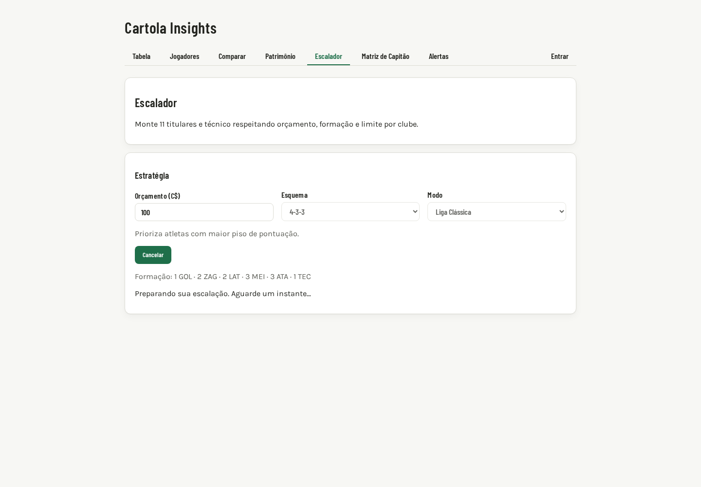

# Evidências — Issue #40 — Aguardar quota do Escalador

## Captura do estado de carregamento



A captura foi feita no Preview do PR #50 em 26/09/2026, na rota `/escalador`, com o navegador interceptando a chamada de otimização e devolvendo uma resposta `429` elegível (`code=optimization_quota_exceeded`, `Retry-After=8`). O cenário confirma visualmente:

- mensagem acessível `Preparando sua escalação. Aguarde um instante…`;
- botão `Cancelar` disponível;
- campos de orçamento, esquema e modo bloqueados durante a espera;
- ausência de texto técnico de HTTP ou quota na interface.

O backend não foi alterado nem recebeu uma chamada real de quota durante a captura; a interceptação torna a evidência reproduzível e evita consumir a quota compartilhada.

## Validação manual no Preview

1. Abra a URL do Preview publicada no PR e navegue para `Escalador` (`/escalador`).
2. Informe orçamento, esquema e modo e clique em `Montar escalação ótima`.
3. Para reproduzir a espera sem consumir quota, use DevTools → Network → `Fetch/XHR` → `otimizador/escalar` → bloqueio/interceptação local, respondendo `429` com o JSON `{ "code": "optimization_quota_exceeded" }` e o header `Retry-After: 8`.
4. Confirme que aparece `Preparando sua escalação. Aguarde um instante…`, que os três campos ficam desabilitados e que `Cancelar` fica visível.
5. Confirme que não aparecem `429`, `cota`, `Retry-After` ou detalhes de infraestrutura na tela.
6. Aguarde pelo menos 8 segundos e confirme no Network que ocorre uma nova requisição, sem novo clique. Para dois `429` consecutivos, devolva um novo prazo e confirme que cada prazo é respeitado.
7. Clique em `Cancelar` antes do prazo e confirme que o formulário é liberado e que nenhuma nova requisição é disparada.
8. Repita com erro `422`, `500` e `429` sem código elegível; confirme que o fluxo termina com mensagem amigável e sem retry automático.

## Resultado automatizado

Comandos obrigatórios executados no commit desta evidência:

```text
npm run lint
npm run coverage
npm run test:e2e
npm run build
```

Resultados da rodada local:

- `npm run lint`: passou; os dois warnings preexistentes de `AuthContext.tsx` permanecem.
- `npm run coverage`: 54 arquivos e 671 testes passaram; statements 99,53%, branches 96,97%, functions 100% e lines 99,78%.
- `npm run test:e2e`: 2 testes passaram (desktop e mobile).
- `npm run build`: passou; TypeScript e Vite produziram o bundle de produção.

## DOD

- [x] Captura do loading no Preview anexada ao repositório.
- [x] Passo a passo de validação manual no Preview documentado.
- [x] Evidência explica a simulação controlada do `429` e não expõe detalhes técnicos ao usuário.
- [ ] CI do PR #50 concluído com todos os checks verdes após o push.
